# Catálogo de máquinas Tecnotron en WordPress · Guía de uso

Cómo funciona el plugin **Tecnotron Máquinas** y cómo se gestiona el catálogo desde WordPress. Para instalarlo, regenerar el zip o trabajar en el código, ver el [README](../README.md).

## Resumen

El catálogo público es un plugin de WordPress, **Tecnotron Máquinas**, que se instala en tecnotron.es. Cada máquina se gestiona desde el panel de WordPress como una entrada más, con su ficha, fotos, modelo 3D (GLB) y PDF. El configurador interno (plataformas.app.tecnotron.es) sigue siendo privado: solo sirve para preparar y exportar los GLB.

Lo que ve el visitante sale de tres direcciones, todas servidas por WordPress:

| Dirección | Qué muestra | Para quién |
| --- | --- | --- |
| tecnotron.es/maquinas/ | Catálogo: buscador, categorías, tarjetas y formulario de presupuesto | Cualquier visitante |
| tecnotron.es/maquinas/diggy/ | Ficha completa: carrusel de fotos, 3D, descripción, características, dibujo de dimensiones y descargas | Visitante, Google, enlaces compartidos |
| tecnotron.es/maquinas/diggy/visor/ | Solo el modelo 3D a pantalla completa, con el botón de realidad aumentada | El móvil que escanea el QR, catálogos impresos, ferias |

Desde el catálogo, la ficha se abre en una ventana sin salir de la página, pero la dirección cambia a la de la máquina. Así cada ficha se puede compartir y Google la indexa.

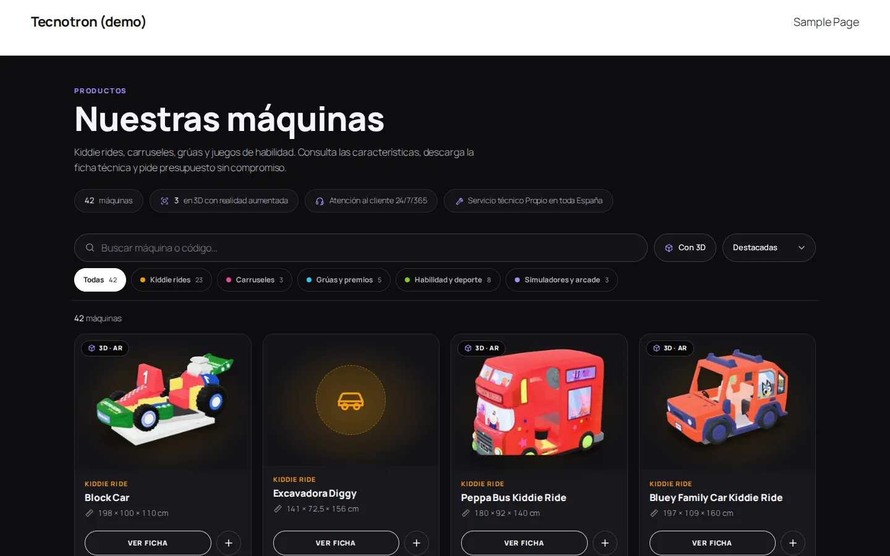

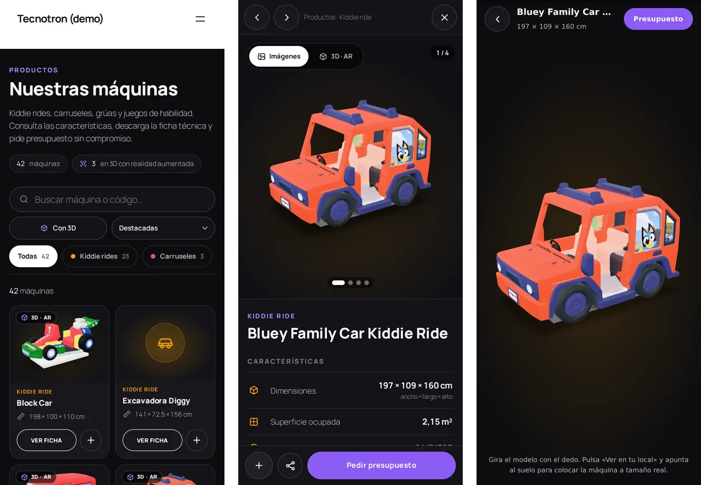

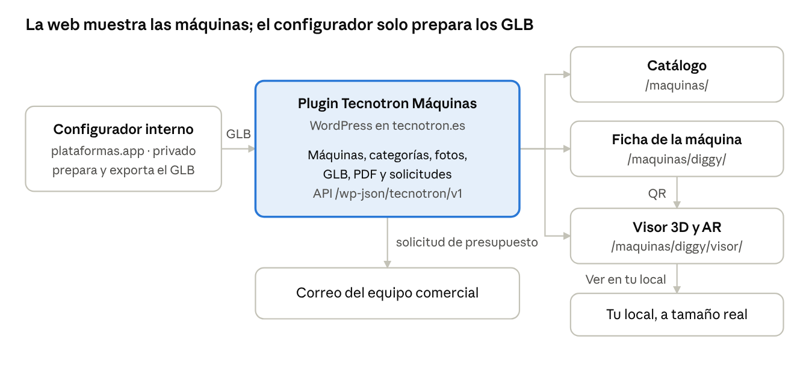

El configurador solo entrega GLB al plugin; todo lo público (catálogo, ficha, visor y solicitudes) sale de WordPress.

> **Desde la versión 1.4 las fichas se escriben en Plataformas.** Con la [sincronización](#sincronización-con-plataformas) conectada, descripción, características, fotos, PDF y modelo 3D de cada máquina se editan en plataformas.app.tecnotron.es y WordPress los copia solo. WordPress sigue sirviendo todo lo público.

## El QR y el visor 3D

El QR solo contiene una dirección: la del visor de esa máquina en la propia web, por ejemplo tecnotron.es/maquinas/diggy/visor/. No apunta al configurador ni necesita usuario ni contraseña.

Para qué sirve: la realidad aumentada solo funciona en el móvil. En el ordenador, el botón «Verla en tu local con el móvil» muestra el QR; el cliente lo escanea, se abre el visor en su teléfono y pulsa «Ver en tu local» para colocar la máquina a tamaño real con la cámara.

1. El visitante abre una ficha en el ordenador.
2. Pulsa «Verla en tu local con el móvil» y aparece el QR.
3. Lo escanea con el móvil: se abre el visor de esa máquina.
4. Pulsa «Ver en tu local»: Android abre la cámara con la máquina (Chrome o Scene Viewer) y el iPhone la abre con Quick Look.
5. Desde el visor puede volver a la ficha completa o pedir presupuesto.

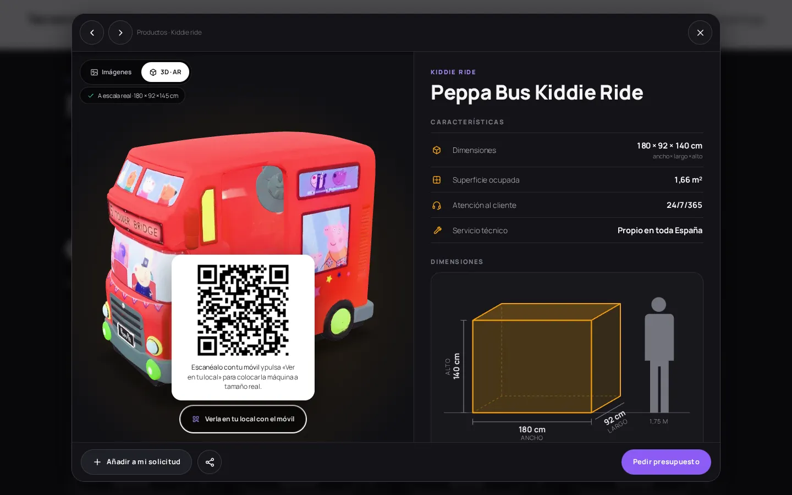

**Por qué no hace falta otra aplicación.** El visor es una página más del plugin: toma el GLB de la biblioteca de medios de WordPress y lo muestra con el componente abierto model-viewer de Google, incluido en el plugin. Al estar en el mismo dominio no hay que configurar permisos entre servidores, y todo se mantiene desde el mismo panel.

**El mismo QR sirve fuera de la web.** Se puede imprimir en catálogos, flyers, stands de feria o en la propia máquina: quien lo escanee ve esa máquina en 3D y en su espacio.

**Si queréis visor.app.tecnotron.es.** Es posible, pero no es necesario. Sería una página estática en ese subdominio que lee la lista de máquinas de la API del plugin (/wp-json/tecnotron/v1/maquinas) y carga el GLB desde tecnotron.es. Requiere permitir en el servidor que ese subdominio descargue los GLB (cabecera CORS) y mantener un despliegue más. Solo compensa si queréis un dominio corto para imprimir o separar el tráfico del visor; en ese caso el QR apuntaría a visor.app.tecnotron.es/diggy.

## Instalación

El plugin se instala en unos cinco minutos desde el panel de WordPress; no hace falta tocar el servidor ni el tema.

1. **Copia de seguridad** de la web (base de datos y archivos), como antes de cualquier plugin.
2. **Plugins → Añadir nuevo → Subir plugin**, elegir tecnotron-maquinas.zip, **Instalar** y **Activar**. Aparece el menú **Máquinas** con las cinco categorías de partida ya creadas.
3. **Máquinas → Importar / exportar → Crear el catálogo inicial** (opcional): da de alta las 42 máquinas del configurador con nombre, categoría y medidas. Diggy y Grúa de tren llevan la ficha completa.
4. **Máquinas → Ajustes**: correo que recibe las solicitudes, datos comunes y textos del catálogo.
5. Abrir **tecnotron.es/maquinas/**. Si diera error 404, ir a **Ajustes → Enlaces permanentes** y pulsar **Guardar** sin cambiar nada.
6. **Menú del sitio**: enlazar «Productos» a /maquinas/, o poner el shortcode `[tecnotron_catalogo]` en la página de productos actual. Con `[tecnotron_catalogo categoria="kiddie-rides"]` se muestra una sola categoría.

**Requisitos:** WordPress 6.2 o superior y PHP 7.4 o superior. Funciona con temas clásicos (incluidos los de Elementor) y con temas de bloques: el catálogo y las fichas usan la cabecera y el pie del tema. Los botones, el buscador, los campos y las listas del catálogo no heredan los estilos del tema, así que se ven igual en cualquier web. Si el tema tiene cabecera fija (como Impreza en tecnotron.es), el catálogo y las fichas empiezan debajo de ella y la barra de filtros se queda justo debajo al bajar. Si hay un plugin de SEO (Yoast, Rank Math, All in One SEO), este se encarga de la descripción y Open Graph de cada ficha.

**Probado** en WordPress 6.4 con PHP 8.4 (tema clásico y Twenty Twenty-Four) y en WordPress 6.8 con PHP 8.3 en modo depuración (Twenty Twenty-Five), en escritorio y móvil: catálogo, filtros, ficha, carrusel, 3D, QR, ficha impresa, formulario, importación y exportación, conversión de OBJ, y el catálogo con los estilos de un tema agresivo (tipo Hello Elementor). Las mismas pruebas se pueden repetir con `npm test` (ver README).

## Gestionar máquinas

Cada máquina es una entrada del menú **Máquinas**; todo lo que se ve en su ficha se edita en una sola pantalla: **Máquinas → Todas las máquinas → clic en el nombre** (o en el enlace **Imágenes, ficha y 3D** que aparece al pasar el ratón). La «Edición rápida» del listado sólo cambia nombre, categoría y estado: no tiene imágenes, datos ni 3D.

Arriba de esa pantalla, el panel **Contenido de la ficha** muestra lo que tiene la máquina (✓ en verde) y lo que le falta (+ en rojo). Cada apartado lleva a su caja y la abre:

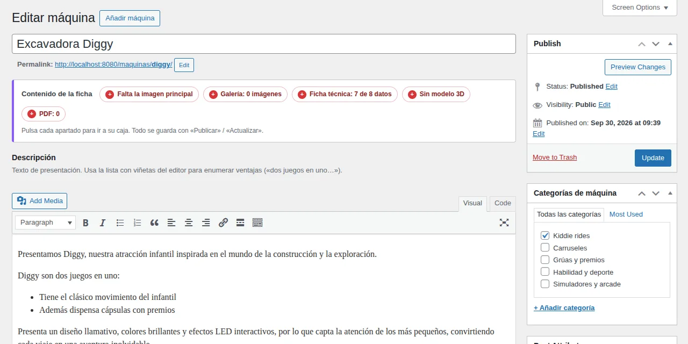

**Añadir una máquina:** Máquinas → Añadir máquina, y rellenar de arriba abajo:

| Parte de la pantalla | Qué va | Dónde se ve |
| --- | --- | --- |
| Nombre de la máquina | «Excavadora Diggy» | Tarjeta, ficha, correo de solicitud |
| Descripción (editor) | Texto de presentación; las ventajas, con la lista de viñetas del editor | Ficha y PDF, bloque «Descripción» |
| Ficha técnica | Código, consumo, alimentación, conformidad, peso, ancho, largo y alto | Ficha, bloque «Características» y dibujo de dimensiones |
| Galería de imágenes | Fotos adicionales, en el orden del carrusel | Carrusel de la ficha |
| Modelo 3D y realidad aumentada | Archivo .glb | Pestaña «3D · AR», visor del QR |
| Fichas técnicas en PDF | PDF del fabricante con su texto | Bloque «Descargas» |
| Categorías (lateral) | Una categoría | Filtro del catálogo y rótulo de la tarjeta |
| Imagen principal (lateral) | La mejor foto, fondo neutro o transparente | Tarjeta del catálogo y primera del carrusel |
| Atributos → Orden (lateral) | 10, 20, 30… | Posición en el catálogo |
| Resumen (opcional) | Una o dos frases | Descripción en Google y al compartir |

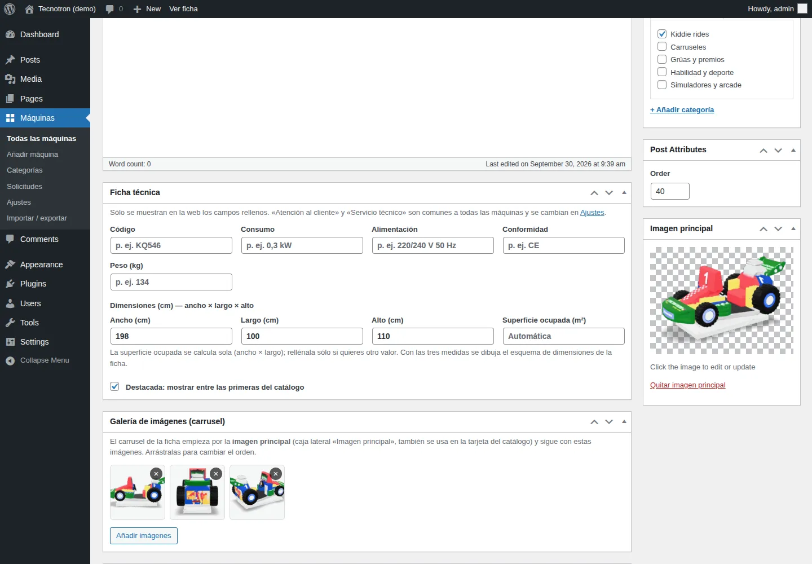

Los campos vacíos no aparecen en la web. La superficie ocupada se calcula sola con ancho × largo. «Atención al cliente» y «Servicio técnico» no se escriben aquí: son comunes y se cambian en Ajustes.

**Editar:** Máquinas → Todas las máquinas, clic en el nombre, cambiar y **Actualizar**. En el listado, la columna **Contenido de la ficha** dice de un vistazo qué tiene cada máquina (en verde) y qué le falta (en gris): foto, galería, datos, 3D y PDF. Cada etiqueta lleva directamente a su caja.

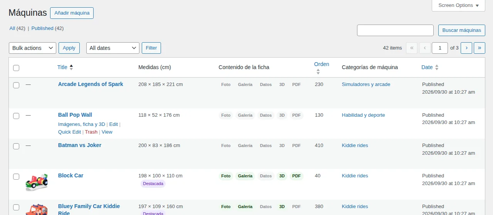

**Si no aparecen las cajas de imágenes, ficha técnica o 3D.** El plugin las muestra siempre: usa el editor clásico para las máquinas aunque otro plugin active el de bloques, quita «Editar con Elementor» de las máquinas (su editor las esconde) y añade «Imagen principal» aunque el tema no la tenga. Si aun así no se ven, comprueba que estás en la pantalla de edición (no en «Edición rápida»), que el plugin está en la versión 1.1.0 o superior (Plugins) y que ningún plugin de administración (Adminimize, Admin Menu Editor…) oculta cajas.

**Ordenar el catálogo:** primero salen las marcadas como **Destacada** (casilla al final de la ficha técnica); después, por el campo **Orden**, de menor a mayor. El visitante también puede ordenar por nombre o tamaño.

**Ocultar sin borrar:** cambiar el estado a **Borrador** en la caja Publicar. Deja de verse en la web y conserva todo; se vuelve a publicar cuando se quiera.

**Quitar:** **Papelera** desde el listado o la ficha. Se recupera desde Papelera durante 30 días. Ojo: su dirección y su QR dejan de funcionar.

## Categorías

Las categorías se gestionan en **Máquinas → Categorías** y cada una tiene su propia página, por ejemplo tecnotron.es/maquinas/categoria/carruseles/.

El plugin crea cinco de partida: Kiddie rides, Carruseles, Grúas y premios, Habilidad y deporte, y Simuladores y arcade. Las asigné por el nombre de cada máquina, así que conviene revisarlas.

| Campo | Para qué sirve |
| --- | --- |
| Nombre | Texto del filtro y título de su página («Carruseles») |
| Slug | Parte de la dirección (carruseles) |
| Nombre en singular | Rótulo encima de cada máquina («CARRUSEL») |
| Color | Punto del filtro, rótulo, viñetas y dibujo de dimensiones |
| Icono | Se muestra cuando la máquina aún no tiene foto |
| Orden | Posición en la fila de filtros (1 = primera) |

- **Crear:** rellenar el formulario de la izquierda y **Añadir categoría**.
- **Renombrar o cambiar color:** pasar el ratón por la categoría → **Editar**.
- **Mover máquinas de categoría:** en el listado de máquinas, marcarlas → Acciones en lote → Editar → marcar la nueva categoría y desmarcar la anterior.
- **Borrar:** Editar → Borrar. Las máquinas no se borran; quedan sin categoría, así que antes hay que pasarlas a otra.

En el catálogo solo aparecen los filtros de categorías con alguna máquina publicada, con su número al lado.

## Modelos 3D (GLB)

Cada máquina admite un archivo .glb: se sube a la biblioteca de medios desde su ficha y el plugin lo muestra en la pestaña «3D · AR» y en el visor del QR.

**1. Preparar el archivo.** La web usa GLB, en metros y con las medidas reales de la máquina. Si la máquina está en **OBJ**, se puede subir tal cual: el plugin lo convierte (paso 3). Para otros formatos (FBX, STL, SKP…), ábrelo en Blender y expórtalo como glTF 2.0 binario (.glb). Los tres modelos de ejemplo pesaban 4–4,5 MB; optimizados quedan en 1,1–1,3 MB sin pérdida visible (están en [modelos/](../modelos/)). Para optimizar otros, desde la carpeta del repositorio:

```bash
npm run optimizar -- maquina.glb --medida 198     # 198 = la mayor de ancho y largo, en cm
npm run imagenes -- modelos/maquina.glb           # 4 imágenes PNG para la galería
```

`--medida` deja el modelo a tamaño real; sin ella se conserva la escala del archivo. Sin el repositorio, basta con la herramienta de glTF-Transform (sin escalar):

```bash
npx @gltf-transform/cli optimize maquina.glb maquina-web.glb --compress quantize --texture-compress webp --texture-size 2048 --simplify false
```

**2. Escala real.** Con «Ver en tu local» la máquina aparece al tamaño del archivo. Al subirlo, la ficha del panel muestra su tamaño y avisa si no coincide con ancho, largo y alto.

| Máquina | Ficha (cm) | Modelo 3D (cm) | Resultado |
| --- | --- | --- | --- |
| Peppa Bus | 180 × 92 × 140 | 180 × 92 × 145 | A escala real |
| Block Car | 198 × 100 × 110 | 198 × 93 × 91 | Aviso: más bajo que la máquina |
| Bluey Family Car | 197 × 109 × 160 | 197 × 114 × 133 | Aviso: más bajo que la máquina |

Los tres ya están ajustados al ancho de su ficha (`npm run optimizar -- … --medida`). Los modelos generados con IA no siempre respetan las proporciones; lo ideal es exportarlos ya ajustados desde el configurador (ver Siguientes pasos).

**3. Subir y enlazar.** En la ficha de la máquina, caja **Modelo 3D y realidad aumentada** → **Elegir o subir GLB** → arrastrar el archivo → **Usar este modelo** → **Actualizar**. Aparece la vista previa girando y la comprobación de tamaño. También se puede pegar una dirección https si el GLB está en otro servidor.

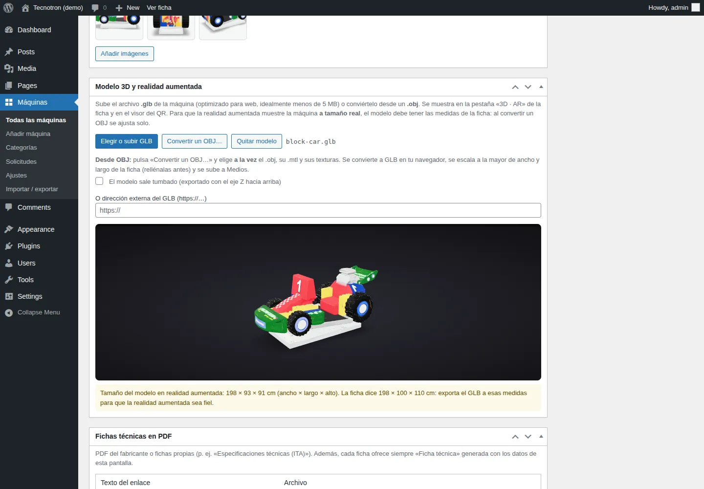

**3 bis. Subir un OBJ.** En la misma caja, **Convertir un OBJ…** → elige **a la vez** el archivo .obj, su .mtl y sus texturas (.jpg, .png) → el navegador lo convierte a GLB, lo escala a la mayor de ancho y largo de la ficha (rellénalas antes), lo apoya en el suelo y lo sube a Medios → **Actualizar**. Si falta alguna textura, lo avisa con su nombre. Si el modelo sale tumbado, marca «El modelo sale tumbado» y vuelve a convertirlo. Sin medidas en la ficha, deduce si el OBJ está en milímetros, centímetros o metros.

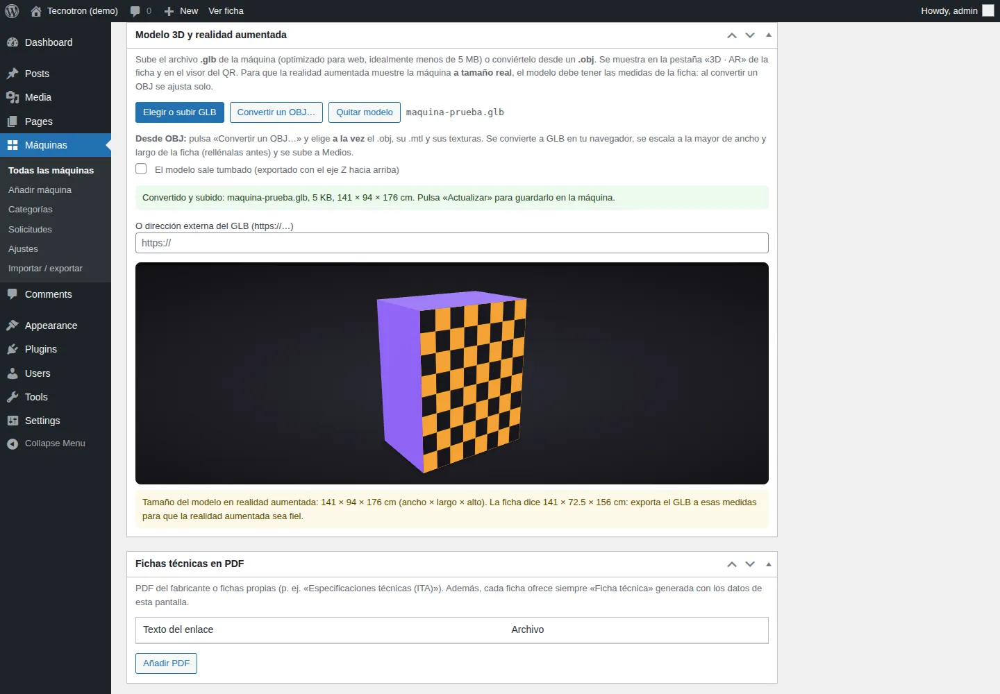

El GLB convertido guarda las texturas tal cual (JPEG o PNG) y no comprime la geometría. Para modelos pesados, `npm run optimizar` (ver README) lo deja más ligero.

**4. Cambiar o quitar.** Elegir otro archivo o pulsar **Quitar modelo**. Los GLB subidos se ven en Medios con el filtro «Modelos 3D».

En Android la realidad aumentada usa Chrome o Scene Viewer; en iPhone, Quick Look, que model-viewer genera al vuelo desde el GLB. No hace falta preparar archivos USDZ.

## Imágenes y carrusel

La pestaña «Imágenes» de la ficha es un carrusel: empieza por la imagen principal y sigue con la galería, en el orden en que estén.

- **Imagen principal** (caja lateral): la foto de la tarjeta del catálogo y la primera del carrusel. Mejor con fondo transparente o neutro, como las de la web actual.
- **Galería de imágenes (carrusel)**: **Añadir imágenes** abre la biblioteca y permite elegir varias a la vez. Se reordenan arrastrando las miniaturas y se quitan con la ×.
- **Tamaño recomendado:** unos 1.200 px de ancho. WordPress genera las versiones pequeñas y el navegador descarga la adecuada para cada pantalla.
- **Cualquier proporción:** verticales, cuadradas o apaisadas, cada foto se encaja entera en su recuadro (4:3 en la tarjeta del catálogo); nunca se recorta ni estira la tarjeta ni obliga a desplazarse en la ficha.
- **Texto alternativo:** el de cada imagen en Medios; si está vacío se usa el nombre de la máquina.

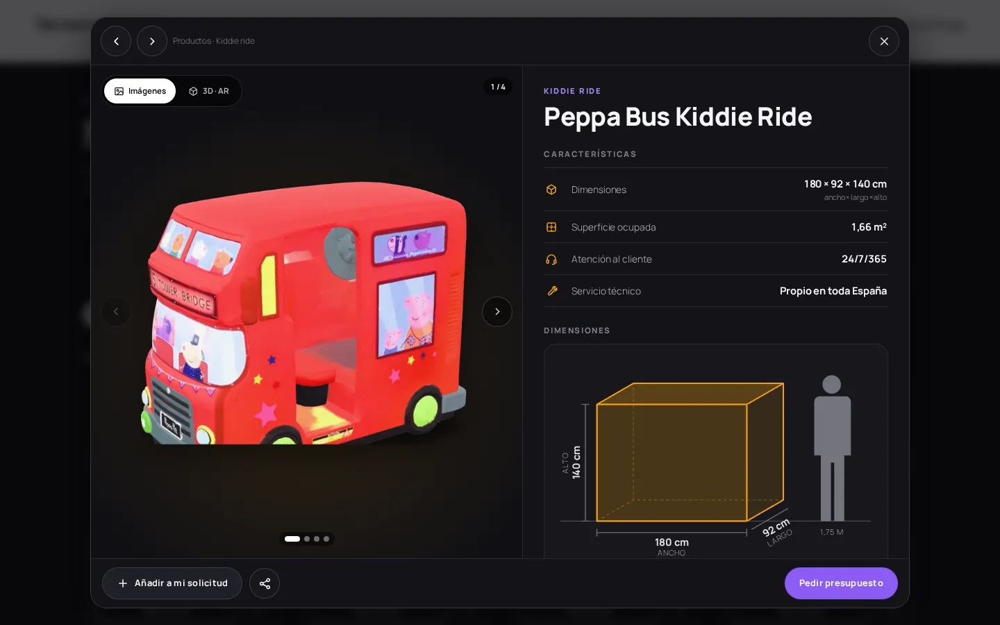

En el móvil el carrusel se pasa con el dedo; en el ordenador, con flechas, puntos o las teclas ← →. Si la máquina tiene modelo 3D, la ficha abre en la pestaña **3D · AR** y al lado está **Imágenes**; sin modelo 3D sólo aparece **Imágenes**. En Ajustes se puede hacer que abra en Imágenes y, en la caja «Ficha técnica» de cada máquina, elegir su propia vista inicial; si falta lo elegido (no hay modelo 3D o no hay fotos), abre con lo otro. Sin fotos, se muestra el icono de su categoría.

## Fichas técnicas en PDF

Cada ficha ofrece siempre una ficha técnica generada con sus datos, y además los PDF que se añadan a mano.

**Ficha generada.** El botón «Ficha técnica · \<máquina>» descarga al momento un PDF de dos páginas A4, con el estilo de las fichas de fábrica:

1. **Portada:** fondo de triángulos, franjas diagonales, logo, el nombre en una banda de color, la foto principal grande, una segunda foto en un círculo y un pie oscuro con teléfono, correo, web y dirección.
2. **Detalle:** el nombre entre comillas, la descripción (con sus negritas y listas) junto a otra foto, «Características técnicas» con un icono por dato y el dibujo de dimensiones a escala con una persona de 1,75 m.

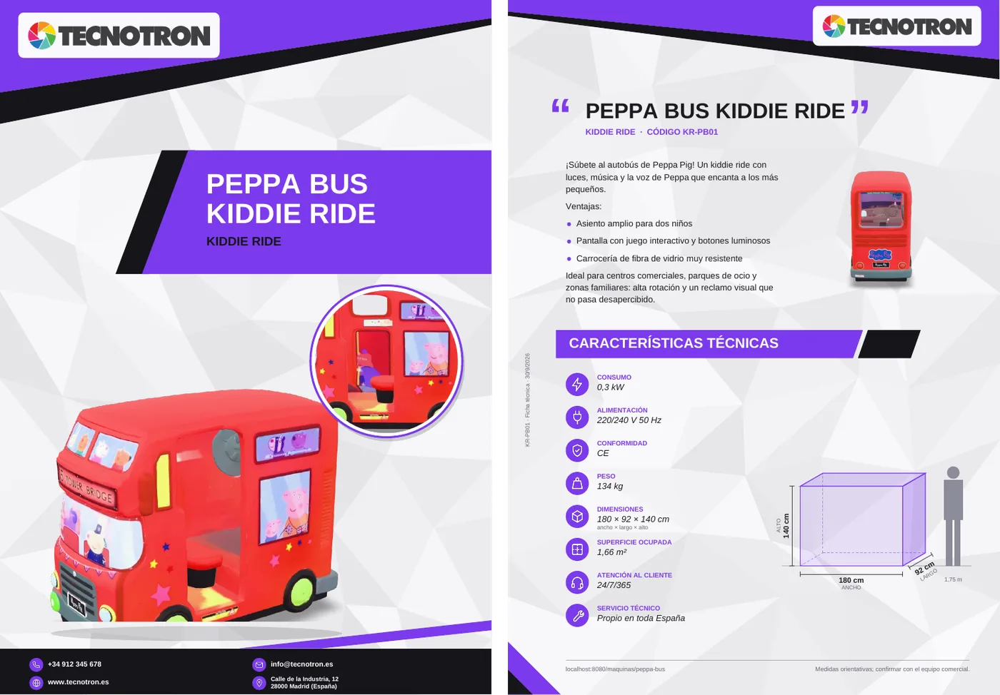

El PDF se genera en el navegador del visitante con los datos de ese momento: si cambias algo de la máquina, la siguiente descarga ya sale actualizada. Sin fotos, la portada muestra el dibujo de dimensiones en grande. El **color**, el **logo** y los **datos de contacto** del pie se configuran en **Máquinas → Ajustes → Ficha técnica en PDF**. En navegadores muy antiguos, el botón abre la versión para imprimir de antes.

**PDF del fabricante o propios.** Caja **Fichas técnicas en PDF** → **Añadir PDF** → escribir el texto del enlace («Especificaciones técnicas (ITA)») → **Elegir PDF** en la biblioteca, o pegar una dirección https. Se añaden tantos como haga falta y se quitan con **Quitar**. En la web aparecen en «Descargas» y se abren en otra pestaña.

## Solicitudes de presupuesto

El visitante junta las máquinas que le interesan con el botón + y envía una sola solicitud; el equipo comercial la recibe por correo y queda copia en el panel.

1. En el catálogo o en una ficha pulsa **+** o **Añadir a mi solicitud**. Una barra abajo recuerda cuántas lleva, también si vuelve otro día desde el mismo navegador.
2. **Pedir presupuesto** lleva al formulario, con las máquinas ya puestas. Desde la página de una máquina, esa máquina ya va incluida.
3. Campos: nombre, correo, teléfono, provincia o ciudad, mensaje y consentimiento de datos; los mismos que el formulario actual de la web.
4. Al enviar llega un correo a la dirección de Ajustes, con los datos, las máquinas con sus enlaces y la página de origen. «Responder» contesta directamente al cliente.
5. Copia en **Máquinas → Solicitudes**: nombre, contacto, máquinas y fecha.

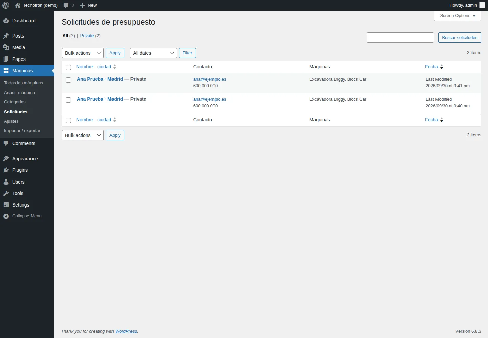

**Correo.** WordPress envía con la configuración del servidor. Si los correos no llegan o caen en spam, hay que instalar un plugin SMTP (WP Mail SMTP, por ejemplo) con la cuenta de correo de la empresa.

**Correo basura.** El formulario tiene un campo trampa invisible para robots, exige unos segundos de relleno y limita a cinco envíos por hora desde la misma conexión. El límite se puede cambiar desde el tema o un plugin con el filtro `tnm_solicitudes_por_hora`.

**Protección de datos.** La casilla enlaza con la política de privacidad de WordPress o con la que se indique en Ajustes. Las solicitudes guardadas son datos personales: hay que borrarlas cuando dejen de ser necesarias, o desactivar la copia en Ajustes.

**Usar el formulario actual.** Si preferís seguir con vuestro formulario (Contact Form 7, WPForms…), pegad su shortcode en Ajustes y añadidle un campo oculto llamado maquinas: recibirá la lista de máquinas elegidas.

## Ajustes generales

**Máquinas → Ajustes** reúne lo que es igual para todo el catálogo:

| Ajuste | Por defecto | Notas |
| --- | --- | --- |
| Título e introducción | «Nuestras máquinas» y un texto breve | Cabecera del catálogo |
| Dirección | maquinas | Cambiarla después rompe los QR ya impresos |
| Vista inicial de la ficha | 3D · AR (si la máquina tiene modelo) | O «Imágenes». Cada máquina puede tener la suya (caja «Ficha técnica» o Plataformas) |
| Datos comunes | Atención al cliente: 24/7/365 · Servicio técnico: Propio en toda España | Una línea por dato, formato «Etiqueta: valor»; salen en todas las fichas |
| Enviar a | El correo del administrador de WordPress | Uno o varios, separados por comas |
| Copia en el panel | Activada | Guarda cada solicitud en Máquinas → Solicitudes |
| Política de privacidad | La página de privacidad de WordPress | Enlace de la casilla de consentimiento |
| Título y texto del bloque de contacto | «Contáctanos» y un texto breve | Encima del formulario |
| Usar otro formulario | Vacío | Shortcode de vuestro formulario actual |
| Ficha PDF: color | Morado | Franjas, banda del título y círculos de las características |
| Ficha PDF: logo | https://www.tecnotron.es/img/logo.png | Se elige en Medios o se pega su dirección. Mejor la versión oscura: va sobre una placa blanca (un logo blanco va sin placa). Sin logo, el del tema o el nombre del sitio |
| Ficha PDF: teléfono, correo, web y dirección | Web del sitio | Pie de la portada; los vacíos no salen |

**Colores y tipografía.** El catálogo usa la tipografía del tema y un diseño oscuro como el de la web actual. Los colores se cambian sin tocar el plugin, con variables en **Apariencia → Personalizar → CSS adicional**; por ejemplo, `.tnm{--tnm-accent:#8b5cf6}` cambia el morado de los botones. Los estilos del tema para botones, campos, listas e imágenes no afectan al catálogo; para cambiar uno de esos elementos desde el CSS adicional, añade `:not(#tnm)` al selector (p. ej. `.tnm-chip:not(#tnm){font-size:14px}`).

## Sincronización con Plataformas

Plataformas (plataformas.app.tecnotron.es) es la única fuente de las fichas: cualquier administrador de Plataformas escribe allí la descripción, las características, las fotos para la web, los PDF y el modelo 3D de cada máquina, y esta web los copia sola. Así no hay dos sitios que mantener iguales.

**Conectarla** (una sola vez):

1. En Plataformas, importar lo que ya hay en la web: **Usuarios → Catálogo de tecnotron.es → Importar lo que ya hay en la web**. Trae las descripciones, fotos, PDF y modelos de aquí a las máquinas de Plataformas que aún no los tengan.
2. En el servidor de Plataformas (Coolify), tres variables: `CATALOG_API_KEYS` (una clave larga, p. ej. `openssl rand -hex 32`), `WEB_WEBHOOK_SECRET` (otro secreto) y `WEB_WEBHOOK_URL` = `https://www.tecnotron.es/wp-json/tecnotron/v1/sincronizar`.
3. Aquí, **Máquinas → Ajustes → Sincronización con Plataformas**: la dirección de Plataformas, la clave y el secreto. Guardar y pulsar **Sincronizar ahora**.

También se pueden poner en `wp-config.php`, fuera de la base de datos: `define( 'TNM_PLATAFORMAS_URL', '…' ); define( 'TNM_PLATAFORMAS_CLAVE', '…' ); define( 'TNM_PLATAFORMAS_SECRETO', '…' );`

**Cómo funciona:**

- La web lee el catálogo de Plataformas **cada 15 minutos** y, además, en cuanto Plataformas avisa de un cambio (aviso firmado: sin el secreto correcto se rechaza). Un cambio guardado en Plataformas se ve en la web en unos segundos.
- Cada máquina se empareja por su identificador de Plataformas y, la primera vez, por su dirección (`/maquinas/block-car/`). Las nuevas se crean; las que se despublican o desaparecen en Plataformas pasan a **borrador** (nunca se borran).
- Fotos, PDF y GLB se copian a la **biblioteca de medios** una sola vez: si no cambian, no se vuelven a descargar.
- El modelo 3D que llega es el que Plataformas prepara para la web: girado, a la medida de la ficha, en metros y con las gráficas corregidas.
- La vista inicial de la ficha («3D · AR» o «Imágenes») también se elige en Plataformas, máquina a máquina.
- La **primera** sincronización no vacía nada que la web tenga y Plataformas todavía no; a partir de ahí, la web es un espejo exacto.
- Las máquinas que solo existen en la web (no están en Plataformas) no se tocan.

**Mientras está conectada**, el listado avisa de que el catálogo se edita en Plataformas, cada máquina sincronizada tiene el enlace **Editar en Plataformas** y sus cajas se ven, pero no se pueden cambiar. Si alguien cambia algo aquí igualmente (el título, por ejemplo), vuelve a lo de Plataformas en la siguiente lectura. Ajustes muestra la última sincronización, sus números (creadas, actualizadas, sin cambios, retiradas) y los avisos, por ejemplo una foto que no se pudo descargar (se reintenta sola).

**Desconectarla:** en Ajustes, «Olvidar la conexión». Las máquinas se quedan con los últimos datos recibidos y vuelven a editarse aquí.

## Importar y exportar en CSV

Para muchas máquinas a la vez se trabaja con una hoja de cálculo: **Máquinas → Importar / exportar**.

- **Catálogo inicial:** el botón **Crear el catálogo inicial** da de alta las 42 máquinas del configurador con nombre, categoría y medidas. Las que ya existan no se tocan.
- **Exportar:** **Descargar CSV** baja todas las máquinas en un archivo que Excel abre con los acentos bien.
- **Editar en bloque:** cambiar en Excel códigos, medidas, pesos o descripciones, guardar como CSV y volver a importarlo con «Actualizar las máquinas que ya existen» marcado. En la prueba, exportar y reimportar las 42 máquinas dio 42 actualizadas y 0 errores.
- **Alta masiva:** añadir filas nuevas al CSV. Con «Crear las nuevas como borrador» no se ven en la web hasta revisarlas y publicarlas.

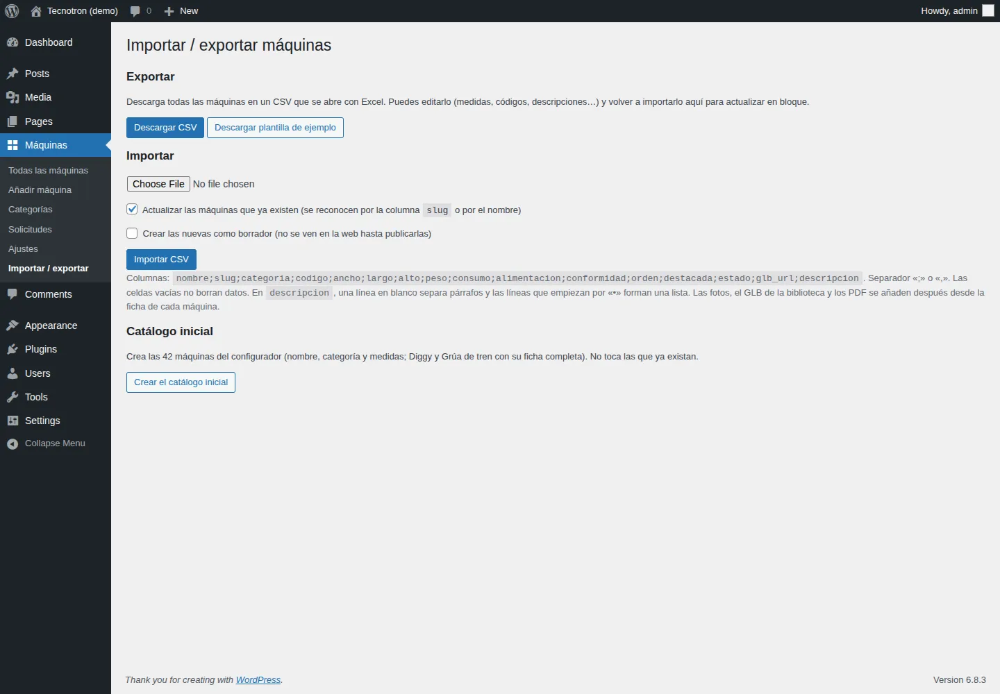

Columnas, en este orden:

```csv
nombre;slug;categoria;codigo;ancho;largo;alto;peso;consumo;alimentacion;conformidad;orden;destacada;estado;glb_url;descripcion
Excavadora Diggy;diggy;Kiddie rides;;141;72,5;156;134;0,3 kW;220/240 V 50 Hz;CE;320;sí;publicada;;"Presentamos Diggy…"
```

Reglas: una celda vacía no borra el dato que ya hay; la categoría se crea si no existe; en la descripción, una línea en blanco separa párrafos y las líneas que empiezan por «•» forman una lista. Las fotos, el GLB de la biblioteca y los PDF se añaden después en la ficha de cada máquina; en glb\_url sí se puede poner una dirección https.

## Estructura técnica

El plugin no depende de otros plugins (ni ACF ni constructores) y no carga nada de servidores externos: model-viewer y el generador de QR van incluidos y solo se descargan cuando se usan.

| Archivo | Qué hace |
| --- | --- |
| tecnotron-maquinas.php | Arranque, activación y categorías de partida |
| includes/post-types.php | Tipos tn\_maquina, tn\_categoria y tn\_solicitud; dirección /visor/ |
| includes/helpers.php | Ajustes, campos de la ficha, iconos y lectura de una máquina |
| includes/render.php | HTML del catálogo, tarjetas, ficha, carrusel, dibujo de dimensiones y formulario |
| includes/frontend.php | Plantillas, shortcode, API, recursos y datos para Google (Product) |
| includes/solicitudes.php | Formulario: validación, antispam, correo y copia en el panel |
| includes/import-export.php | CSV de entrada y salida |
| includes/media.php | Permite subir .glb comprobando que el archivo es glTF |
| includes/sincronizacion.php | Sincronización con Plataformas: lectura del catálogo, tareas programadas, aviso firmado y copia de ficheros |
| includes/admin/\*.php | Cajas de la ficha, campos de categoría, ajustes, columnas e importador |
| templates/catalogo.php, maquina.php, visor.php | Plantillas; se sustituyen copiándolas a ‹tema›/tecnotron-maquinas/ |
| assets/js/tecnotron-maquinas.js | Filtros, ventana de ficha, carrusel, 3D/AR, QR, ficha impresa y formulario, sin jQuery |
| assets/css/tecnotron-maquinas.css | Estilos; las reglas de botones, campos, listas e imágenes llevan `:not(#tnm)` para ganar siempre a las del tema |
| assets/js/admin.js | Pantalla de la máquina: panel de contenido, galería, GLB con vista previa, conversión de OBJ y PDF |
| assets/vendor/ | model-viewer 4.3.1 (Apache-2.0), qrcode-generator 1.5.2 (MIT), ficha-pdf.js (ficha técnica en PDF con pdf-lib 1.17, MIT, generado desde src/ficha-pdf.js) y obj-a-glb.js (conversor OBJ → GLB con three.js 0.183, MIT, generado desde src/obj-a-glb.js); se actualizan con npm y `npm run build` |
| data/maquinas-configurador.csv | Catálogo inicial |

**Datos de cada máquina** (metadatos de la entrada): \_tnm\_codigo, \_tnm\_consumo, \_tnm\_alimentacion, \_tnm\_conformidad, \_tnm\_peso, \_tnm\_ancho, \_tnm\_largo, \_tnm\_alto (cm), \_tnm\_superficie (m², opcional), \_tnm\_destacada, \_tnm\_galeria (IDs de adjunto), \_tnm\_glb\_id o \_tnm\_glb\_url y \_tnm\_fichas; las sincronizadas, además, \_tnm\_plataformas\_id, \_tnm\_plataformas\_editar, \_tnm\_plataformas\_firma y \_tnm\_plataformas\_modificada (y cada fichero copiado, \_tnm\_origen con su dirección en Plataformas). La descripción es el contenido de la entrada; el orden, menu\_order. Las categorías guardan tnm\_singular, tnm\_color, tnm\_icono y tnm\_orden.

**API pública** (solo lectura, máquinas publicadas):

- GET /wp-json/tecnotron/v1/maquinas — todas, con medidas, GLB, imágenes, PDF, ficha y visor. Sirve para el configurador, un visor en otro dominio u otras webs.
- GET /wp-json/tecnotron/v1/maquinas/{id}/ficha — el HTML de la ficha que usa la ventana del catálogo.
- POST /wp-json/tecnotron/v1/sincronizar — aviso de Plataformas (cabecera `X-Plataformas-Signature: sha256=<HMAC del cuerpo>`); responde 202 y sincroniza en segundo plano.

**Dirección de cada ficha.** La ventana del catálogo cambia la dirección a la de la máquina sin recargar. Esa misma dirección, abierta directamente, la genera el servidor completa, para Google y para compartir. El visor lleva noindex para no duplicar la ficha en Google.

**Al desinstalar** no se borra nada: máquinas, categorías, imágenes, GLB y solicitudes se quedan en la base de datos y la biblioteca.

## Siguientes pasos

- [ ] Instalar el plugin en un entorno de pruebas de tecnotron.es (o con copia de seguridad) y crear el catálogo inicial.
- [ ] Revisar las categorías asignadas a cada máquina.
- [ ] Subir la imagen principal y la galería de cada máquina desde las fotos actuales de la web.
- [ ] Completar las fichas (consumo, alimentación, conformidad, peso, descripción), a mano o con el CSV.
- [ ] Subir los GLB de [modelos/](../modelos/) a Block Car, Peppa Bus y Bluey, y el resto (GLB u OBJ) a medida que estén.
- [ ] Configurar el correo de solicitudes y, si hace falta, un plugin SMTP; enviar una solicitud de prueba.
- [ ] Probar «Ver en tu local» en un Android y en un iPhone desde la web publicada.
- [ ] Enlazar «Productos» del menú a /maquinas/ y redirigir las fichas antiguas a las nuevas (plugin Redirection) para no perder posicionamiento.
- [x] Configurador: «Preparar para la web» guarda el modelo ya ajustado a ancho, largo y alto, en metros y con las gráficas (Plataformas).
- [ ] Conectar la [sincronización con Plataformas](#sincronización-con-plataformas) tras importar allí lo que ya hay en la web.
